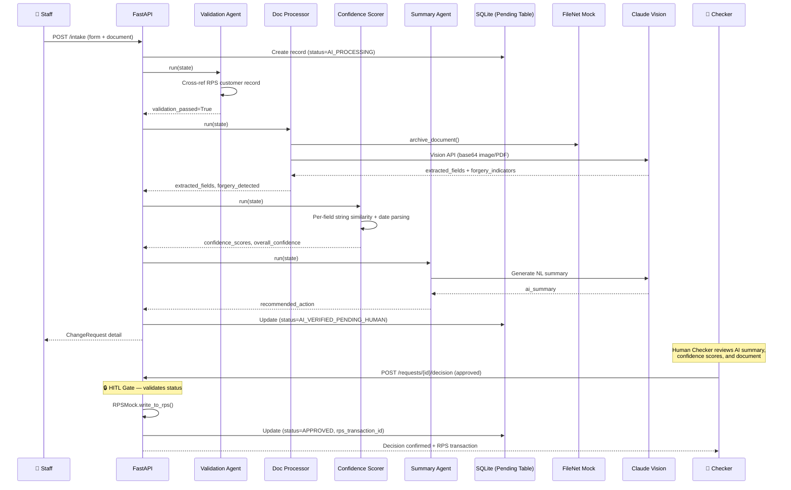

# IASW System Architecture

## Full System Diagram

```mermaid
flowchart TD
    subgraph FE["🖥️  Frontend — Next.js 14"]
        A["Staff Intake Form\n(4-Step Wizard)"] 
        B["Checker Queue\n(Pending Table View)"]
        C["Checker Review UI\nConfidence Scores · AI Summary · Document"]
    end

    subgraph API["⚡ FastAPI Backend"]
        D["POST /api/intake/sync\nMultipart upload handler"]
        E["GET /api/requests\nList & filter requests"]
        F["POST /api/requests/{id}/decision\n🔒 HITL Gate — Human only"]
    end

    subgraph PIPELINE["🤖 AI Agent Pipeline"]
        G["Agent 1\nValidation Agent\nRPS field cross-reference"]
        H["Agent 2\nDocument Processor\nClaude Vision OCR + Forgery Detection"]
        I["Agent 3\nConfidence Scorer\nPer-field weighted scoring"]
        J["Agent 4\nSummary Agent\nNL summary + recommendation"]
    end

    subgraph STORAGE["💾 Storage Layer"]
        K[("SQLite\nPending Table\nChangeRequest")]
        L["FileNet Mock\nDocument Archive\n(local filesystem)"]
        M["Upload Dir\nTemp document storage"]
    end

    subgraph EXTERNAL["🏦 External Systems (Mocked)"]
        N["RPS Mock\nCore Banking System\nIn-memory customer store"]
        O["Claude claude-sonnet-4-20250514\nAnthropic API\nVision + LLM"]
    end

    subgraph OBS["📊 Observability"]
        P["Structured JSON Logger\nPer-step agent audit trail\nlogs/iasw.jsonl"]
    end

    A -->|"multipart/form-data"| D
    D --> G
    G -->|"validate vs RPS"| N
    G --> H
    H -->|"base64 doc"| O
    H -->|"archive"| L
    I --> J
    J --> K
    K --> E
    E --> B
    B --> C
    C -->|"Checker clicks Approve/Reject"| F
    F -->|"🔒 ONLY on human approval"| N
    PIPELINE --> P
    API --> P

    style F fill:#f59e0b,color:#fff,stroke:#d97706
    style N fill:#1e40af,color:#fff
    style O fill:#7c3aed,color:#fff
```



## Agent Decomposition



## HITL Boundary Design

```
┌─────────────────────────────────────────────────────────────┐
│                    AI AUTONOMY BOUNDARY                      │
│                                                              │
│  ✅ AI CAN DO AUTONOMOUSLY:                                  │
│    • Read from RPS (customer lookup)                         │
│    • OCR and extract document fields                         │
│    • Score confidence per field                              │
│    • Generate summary and recommendation                     │
│    • Archive to FileNet                                      │
│    • Write to Pending Table (staging only)                   │
│                                                              │
│  🔒 AI CANNOT DO WITHOUT HUMAN:                             │
│    • Call POST /requests/{id}/decision                       │
│    • Trigger RPSMock.write_to_rps()                          │
│    • Change status from AI_VERIFIED_PENDING_HUMAN            │
│    • Modify live customer records                            │
│                                                              │
│  Human Checker is the ONLY entity that can:                  │
│    • Submit a decision (approved / rejected)                 │
│    • Trigger RPS write-call                                  │
│    • Move status to APPROVED or REJECTED                     │
└─────────────────────────────────────────────────────────────┘
```

## Data Model — Pending Table

```sql
CREATE TABLE change_requests (
    id                   TEXT PRIMARY KEY,          -- UUID4
    customer_id          TEXT NOT NULL,
    change_type          TEXT NOT NULL,             -- legal_name|address|dob|contact
    old_value            TEXT NOT NULL,
    new_value            TEXT NOT NULL,
    staff_id             TEXT,
    staff_notes          TEXT,

    -- Document
    document_filename    TEXT,
    document_path        TEXT,
    filenet_reference_id TEXT,
    filenet_metadata     JSON,

    -- AI Results
    extracted_fields     JSON,
    confidence_scores    JSON,
    overall_confidence   REAL,
    forgery_detected     BOOLEAN DEFAULT 0,
    forgery_details      TEXT,
    ai_summary           TEXT,
    recommended_action   TEXT,                      -- approve|review|reject

    -- Status
    status               TEXT DEFAULT 'PENDING',
    -- PENDING → AI_PROCESSING → AI_VERIFIED_PENDING_HUMAN → APPROVED|REJECTED|FAILED

    -- HITL Checker
    checker_id           TEXT,
    checker_decision     TEXT,                      -- approved|rejected
    checker_notes        TEXT,
    checker_timestamp    DATETIME,

    -- RPS
    rps_transaction_id   TEXT,
    rps_status           TEXT,
    rps_response         JSON,

    -- Audit
    agent_logs           JSON,
    error_message        TEXT,
    created_at           DATETIME,
    updated_at           DATETIME,
    ai_completed_at      DATETIME
);
```
